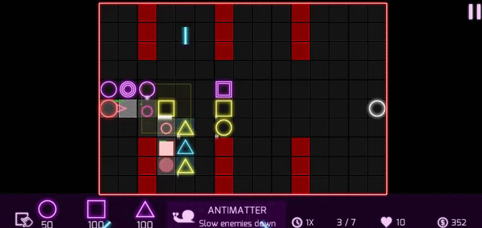
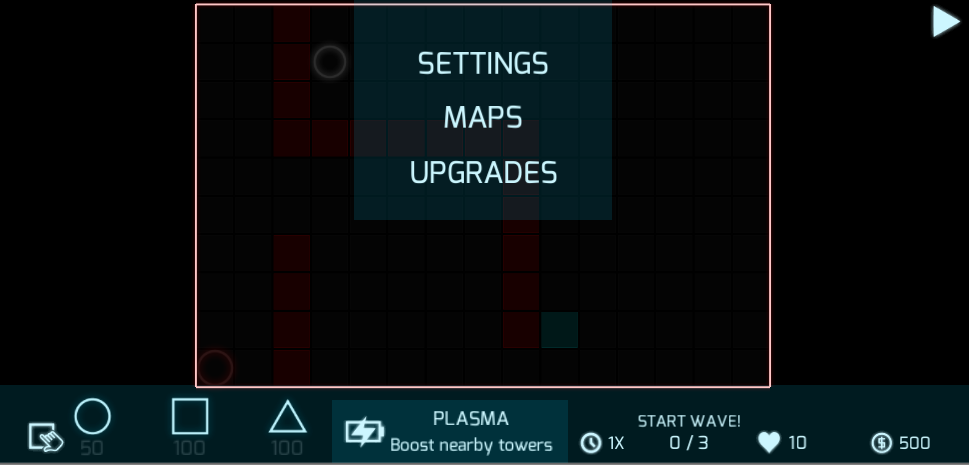
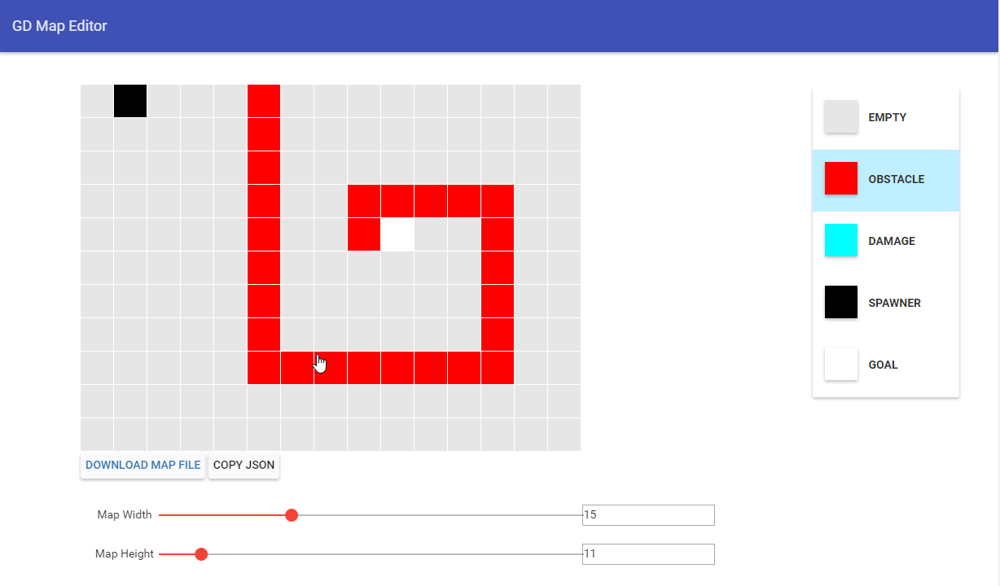

# What is Geometric Defense ?
Geometric Defense is an open source neon themed tower defense game for Android.

It is licensed under GPL V3.

It is being developed using Unity 5 in C#, graphics source files are handled with inkscape in svg format.

# Screenshots

there is a web based map editor that exports maps in a json format.

